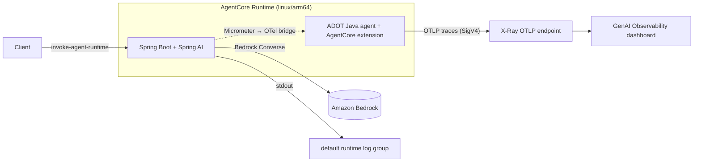
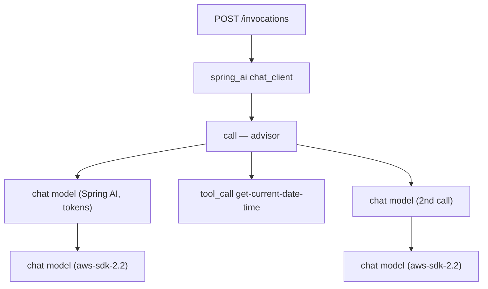

# Spring AI AgentCore Observability

A Spring AI + Amazon Bedrock agent running on **AgentCore Runtime** with full
**OpenTelemetry observability** in the CloudWatch GenAI Observability dashboard.

## Architecture



**How it works:**

- The **ADOT Java agent** auto-instruments the app and exports traces (SigV4-signed) to CloudWatch.
- The **AgentCore OTel extension** (`spring-ai-agentcore-otel-extension`) configures the agent for
  AgentCore's observability mode — adding the required resource attributes, session tracking, and
  noise reduction. It activates when `AGENT_OBSERVABILITY_ENABLED=true` (injected by AgentCore).
- **Spring AI** observations (ChatClient, model calls, tool invocations) are bridged into the same
  trace via `micrometer-tracing-bridge-otel`.
- **Logs** go to stdout → captured by AgentCore into the default runtime log group.
- **`OTEL_RESOURCE_ATTRIBUTES`** is injected by AgentCore at container start (with `cloud.resource_id`,
  `cloud.platform`, `service.name`). Do **not** override it — that breaks dashboard linkage.

## What you see in the dashboard

| Signal | Source |
|--------|--------|
| ChatClient / advisor / tool spans | Spring AI Micrometer observations |
| Bedrock model span + token usage | Spring AI + ADOT aws-sdk instrumentation |
| `POST /invocations` server span | Spring MVC observation |
| Session grouping | `session.id` propagated from baggage by the extension |
| Application logs | container stdout → default runtime log group |

### Example trace



## Prerequisites

- Java 21, Maven, Terraform, AWS CLI
- **Docker or Finch** (set `CONTAINER_CLI`; default `docker`). Image is `linux/arm64`.
- AWS credentials with Bedrock model access.

## One-time setup: enable CloudWatch Transaction Search

Required once per account/region:

```bash
aws logs put-resource-policy \
  --policy-name TransactionSearchAccess \
  --policy-document '{"Version":"2012-10-17","Statement":[{"Sid":"TransactionSearchXRayAccess","Effect":"Allow","Principal":{"Service":"xray.amazonaws.com"},"Action":"logs:PutLogEvents","Resource":["arn:aws:logs:*:*:log-group:aws/spans:*","arn:aws:logs:*:*:log-group:/aws/application-signals/data:*"]}]}'

aws xray update-trace-segment-destination --destination CloudWatchLogs
```

Or: CloudWatch console → **Application Signals (APM) → Transaction search → Enable**.

## Deploy

```bash
./build-and-push.sh                       # build + push image to ECR
./deploy.sh                               # terraform: IAM role + AgentCore runtime
./invoke.sh                               # invoke (triggers the tool, generates a trace)
./invoke.sh "my-session-33chars-minimum" "Your prompt here"
```

## View telemetry

- **Traces**: CloudWatch → **GenAI Observability** → **Bedrock AgentCore** tab
- **Logs**: default runtime log group (`/aws/bedrock-agentcore/runtimes/<runtime-id>-DEFAULT`)
- **Raw spans**: Transaction Search / `aws/spans` log group

Allow ~10 minutes after first invocation for spans to appear.

## The AgentCore OTel Extension

The `spring-ai-agentcore-otel-extension` jar bridges the observability gap between Python and Java
on AgentCore Runtime. It's activated by `AGENT_OBSERVABILITY_ENABLED=true` (injected by AgentCore)
and provides:

| Feature | Why |
|---------|-----|
| `aws.service.type=gen_ai_agent` resource attribute | Required for the "Bedrock AgentCore" dashboard tab |
| `session.id` baggage → span attribute | Groups traces by session in the dashboard |
| `parentbased_always_on` sampler | 100% span capture for agent observability |
| Disable AWS resource detectors | Prevents `cloud.platform=aws_ec2` from overriding AgentCore's value |
| Disable Application Signals | Avoids duplicate cost with Transaction Search |
| Disable `http-url-connection` + Tomcat/Servlet instrumentation | Suppresses IMDS noise and duplicate server spans |

**Usage in your Dockerfile:**

```dockerfile
ARG AGENTCORE_EXT_VERSION=1.1.0
RUN curl -fsSL -o /app/agentcore-otel-extension.jar \
    "https://repo1.maven.org/maven2/org/springaicommunity/spring-ai-agentcore-otel-extension/${AGENTCORE_EXT_VERSION}/spring-ai-agentcore-otel-extension-${AGENTCORE_EXT_VERSION}.jar"

ENV OTEL_JAVAAGENT_EXTENSIONS=/app/agentcore-otel-extension.jar
```

All settings are defaults — override any with environment variables if needed.

## Configuration

| Setting | Where | Default |
|---------|-------|---------|
| Model | `application.properties` | `global.amazon.nova-2-lite-v1:0` |
| Trace endpoint | Terraform env var | `https://xray.<region>.amazonaws.com/v1/traces` |
| Sampling | `application.properties` | `1.0` (100%) |
| Prompt/completion logging | `application.properties` | disabled (sensitive) |
| ADOT agent version | `Dockerfile` `ADOT_VERSION` | `v2.26.2` |

## Cleanup

```bash
cd terraform && terraform destroy
aws ecr delete-repository --repository-name "$(cat terraform/ecr-repo-name.txt)" --force
```
